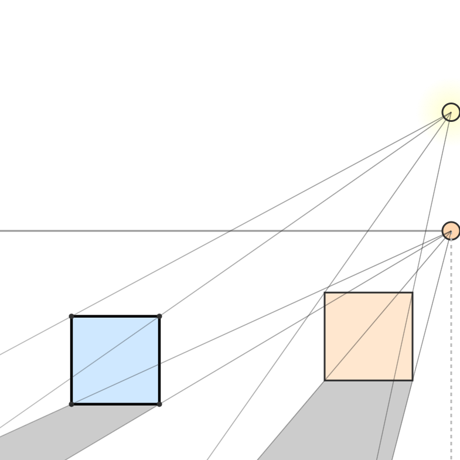
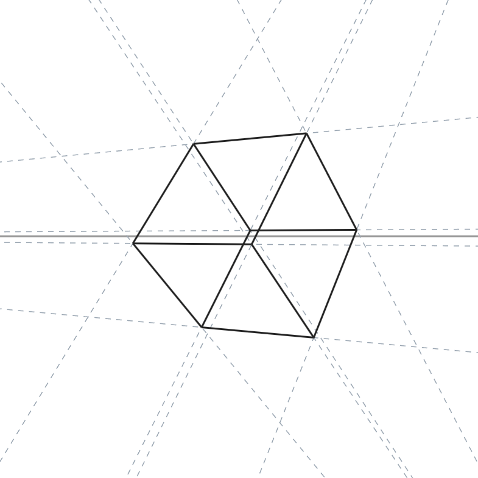

# Visualizations

Interactive visualizations for artists. Stack: React + TypeScript + Vite + React Konva, CSS Modules, React Router. UI via a git submodule (`external/ui-kit`).

Visualizations
- Light + Squares Shadows — interactive light, horizon line, projection and shadows over squares.
- Perspective Cube — true 3‑point perspective, draggable horizon, XYZ rotations and position, drag to move cubes (X/Y; hold Ctrl for X/Z), vanishing lines (selected or all cubes).

Previews

Local development
1) Clone with submodules
   git clone --recurse-submodules git@github.com:SuselMan/Visualizations.git
   cd Visualizations
2) Install deps
   npm i
3) Start dev server
   npm run dev

Build
   npm run build
   npm run preview

Git submodule (UI Kit)
- Repo: git@github.com:SuselMan/UiKit.git
- Path: external/ui-kit
- If cloned without submodules: git submodule update --init --recursive

GitHub Pages
- URL (after first deploy): https://suselman.github.io/Visualizations/
- Config:
  - Vite `base` set to `/Visualizations/`
  - Router `basename` bound to `import.meta.env.BASE_URL`
  - GH Actions workflow `.github/workflows/deploy.yml` builds and deploys on push to `main`
- One‑time enable in repo Settings → Pages → Build and deployment → Source: GitHub Actions

Notes
- Node.js >= 20 recommended (workflow uses Node 22).
- If SSH for submodule is not configured, switch submodule URL to HTTPS or set up SSH keys.
